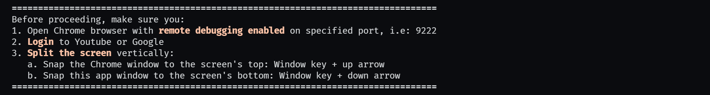
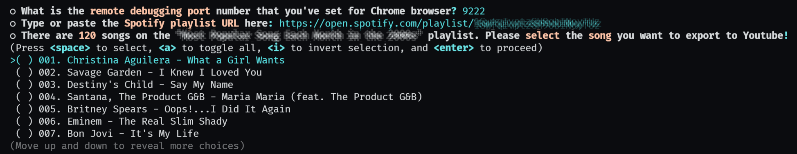
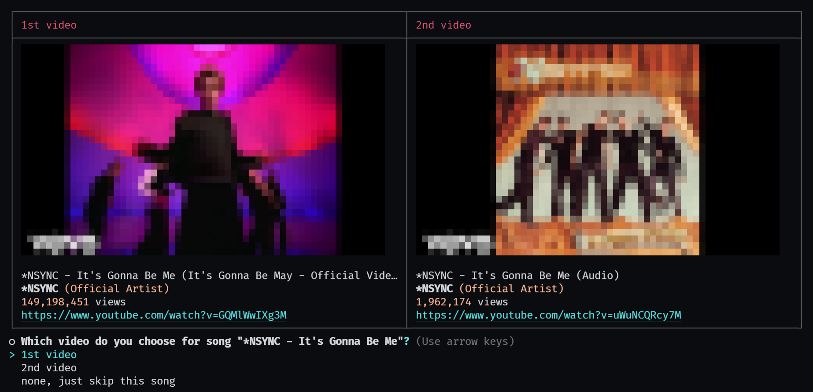
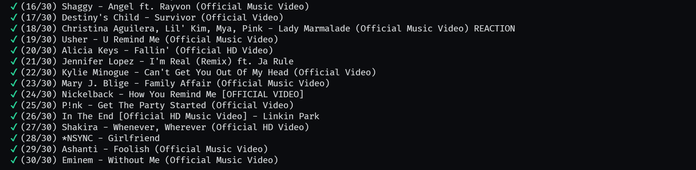

# Spotify to Youtube
(Not so) simple tool to export playlist from Spotify to Youtube

## About The Project
As a visual person I find watching video on Youtube more enjoyable than just listening to music in Spotify. Although I won't be watching videos all the time, only occasionaly. That's why I built this tool to help people like me enjoy their favorite music.

Since the beginning I wanted to make this application as automated as possible with minimal setup and anything. I also don't want to use Youtube Data API because is limited to 10,000 units per day, which means I can only add 200 video to my playlist each day. Another reason is I want to maximize Puppeteer's capability to perform automated actions using Chrome browser, as it does on project [Kindle Highlight Exporter](https://github.com/deddyss/kindle-highlight-exporter).

In the course of developing this app, I encountered two main problems as below:
1. I'm always considered not logging into Google every time I access Youtube via Chrome which is controlled by the Puppeteer, even though Chrome was already running before this application was run. I can't even automate the process of signing in to Google. This is not the case with project [Kindle Highlight Exporter](https://github.com/deddyss/kindle-highlight-exporter). As Chrome and Puppeteer developer, Google does not authorize controlled browsers in the common way, whether or not in headless mode. Unless I enable remote debugging in Chrome on a specific port using command line before running Chrome.
2. Usually Puppeteer can be used to automate form submissions or keyboard input in a headless browser or unfocused tabs, but Youtube is not the case. As part of a Google product, Youtube will only allow automatic button clicks (i.e. adding videos to a playlist or creating a new playlist) if the page is active and visible. To overcome this problem, I have to split the screen vertically between the Chrome browser and this application.

To summarize, my goal of making this app fully automated cannot be attained because of two afforementioned problems. Maybe next time I should go straight to the API when dealing with Google products or apps. I have learned my lesson.

### Screenshots









### Built With
* [TypeScript](https://www.typescriptlang.org/)
* [Inquirer.js](https://github.com/SBoudrias/Inquirer.js)
* [Puppeteer](https://pptr.dev/)

## Getting Started
### Prerequisites
1. You have enabled remote debugging in Chrome browser on a specific port
   ```sh
   chrome.exe --remote-debugging-port=9222
   ```
2. You have access to Spotify playlist in Chrome browser
3. You are logged in to Youtube in Chrome browser
4. You keep the Chrome browser open

### Usage
1. Download file Spotify-to-Youtube.exe from [latest release](https://github.com/deddyss/spotify-to-youtube/releases/latest)
2. Run file Spotify-to-Youtube.exe
3. If you want to develop, modify or build the application by yourself, please refer to [`DEVELOPMENT`](DEVELOPMENT.md)

## License
Distributed under the MIT License. See [`LICENSE`](LICENSE) for more information.

## Acknowledgements
* [Jest](https://jestjs.io/)
* [Got](https://github.com/sindresorhus/got)
* [Terminal-image](https://github.com/sindresorhus/terminal-image)
* [Ora](https://github.com/sindresorhus/ora)
* [Chalk](https://github.com/chalk/chalk)
* [Webpack](https://webpack.js.org/)
* [Pkg](https://github.com/vercel/pkg)
